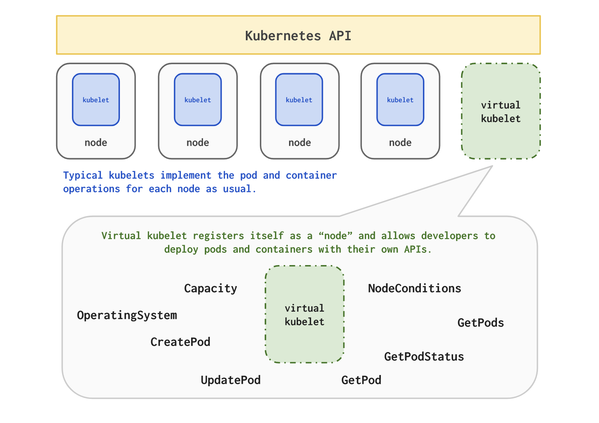

# Virtual-Kubelet and Azure Container Instances

Virtual Kubelet is an open source Kubernetes kubelet implementation that masquerades as a kubelet for the purposes of connecting Kubernetes to other APIs. This allows the nodes to be backed by other services like ACI, Hyper.sh, AWS, etc. This connector features a pluggable architecture and direct use of Kubernetes primitives, making it much easier to build on.

## How It Works

The diagram below illustrates how Virtual-Kubelet works.



## Cluster Setup

1. List your Azure subscriptions:
    ```console
    az account list -o table
    ```
2. Copy your subscription ID and save it in an environment variable:

    **Bash**
    ```console
    export AZURE_SUBSCRIPTION_ID="<SubscriptionId>"
    ```

### Create a Resource Group for ACI

To use Azure Container Instances, you must provide a resource group. We will use the existing Resource Group you were assigned.

```console
export ACI_REGION=eastus
az group list
```
Output:
```
[
    {
        "id": "/subscriptions/b23accae-e655-44e6-a08d-85fb5f1bb854/resourceGroups/ODL-aks-v2-gbb-8386",
        "location": "centralus",
        "managedBy": null,
        "name": "ODL-aks-v2-gbb-8386",
        "properties": {
        "provisioningState": "Succeeded"
        },
        "tags": {
        "AttendeeId": "8391",
        "LaunchId": "486",
        "LaunchType": "ODL",
        "TemplateId": "1153"
        }
    }
    ]
```

Copy the name from the results above and set to a variable:
```
export AZURE_RG=ODL-aks-v2-gbb-8386
```

### Create a service principal

This creates an identity for the Virtual Kubelet ACI provider to use when provisioning
resources on your account on behalf of Kubernetes.

1. Us the service principal that was provided during the course lab enrollment:
   
1. Save the values from Service Principal details in environment variables:

    **Bash**
    ```console
    export AZURE_TENANT_ID=<Tenant>
    export AZURE_CLIENT_ID=<AppId>
    export AZURE_CLIENT_SECRET=<Password>
    ```

## Deployment of the ACI provider in your cluster

Run these commands to deploy the virtual kubelet which connects your Kubernetes cluster to Azure Container Instances.

If your cluster is an AKS cluster:

```console
export VK_IMAGE_TAG=0.2-beta-9
````

```console
RELEASE_NAME=virtual-kubelet
NODE_NAME=virtual-kubelet

cd ~
git clone https://github.com/virtual-kubelet/virtual-kubelet.git
cd virtual-kubelet

curl https://raw.githubusercontent.com/virtual-kubelet/virtual-kubelet/master/scripts/createCertAndKey.sh > createCertAndKey.sh
chmod +x createCertAndKey.sh
. ./createCertAndKey.sh

helm install ~/virtual-kubelet/charts/virtual-kubelet-for-aks/  --name "$RELEASE_NAME" \
    --set env.azureClientId="$AZURE_CLIENT_ID",env.azureClientKey="$AZURE_CLIENT_SECRET",env.azureTenantId="$AZURE_TENANT_ID",env.azureSubscriptionId="$AZURE_SUBSCRIPTION_ID",env.aciResourceGroup="$AZURE_RG",env.nodeName="$NODE_NAME",env.nodeOsType=<Linux|Windows>,env.apiserverCert=$cert,env.apiserverKey=$key,image.tag="$VK_IMAGE_TAG"
```

Output:

```console
NAME:   virtual-kubelet
LAST DEPLOYED: Thu Feb 15 13:17:01 2018
NAMESPACE: default
STATUS: DEPLOYED

RESOURCES:
==> v1/Secret
NAME                             TYPE    DATA  AGE
virtual-kubelet-virtual-kubelet  Opaque  3     1s

==> v1beta1/Deployment
NAME                             DESIRED  CURRENT  UP-TO-DATE  AVAILABLE  AGE
virtual-kubelet-virtual-kubelet  1        1        1           0          1s

==> v1/Pod(related)
NAME                                              READY  STATUS             RESTARTS  AGE
virtual-kubelet-virtual-kubelet-7bcf5dc749-6mvgp  0/1    ContainerCreating  0         1s


NOTES:
The virtual kubelet is getting deployed on your cluster.

To verify that virtual kubelet has started, run:

  kubectl --namespace=default get pods -l "app=virtual-kubelet-virtual-kubelet"
```

## Validate the Virtual Kubelet ACI provider

To validate that the Virtual Kubelet has been installed, return a list of Kubernetes nodes using the [kubectl get nodes][kubectl-get] command. You should see a node that matches the name given to the ACI connector.

```azurecli-interactive
kubectl get nodes
```

Output:

```console
NAME                                        STATUS    ROLES     AGE       VERSION
virtual-kubelet                             Ready     <none>    2m        v1.8.3
aks-nodepool1-39289454-0                    Ready     agent     22h       v1.7.7
aks-nodepool1-39289454-1                    Ready     agent     22h       v1.7.7
aks-nodepool1-39289454-2                    Ready     agent     22h       v1.7.7
```

## Schedule a pod in ACI
