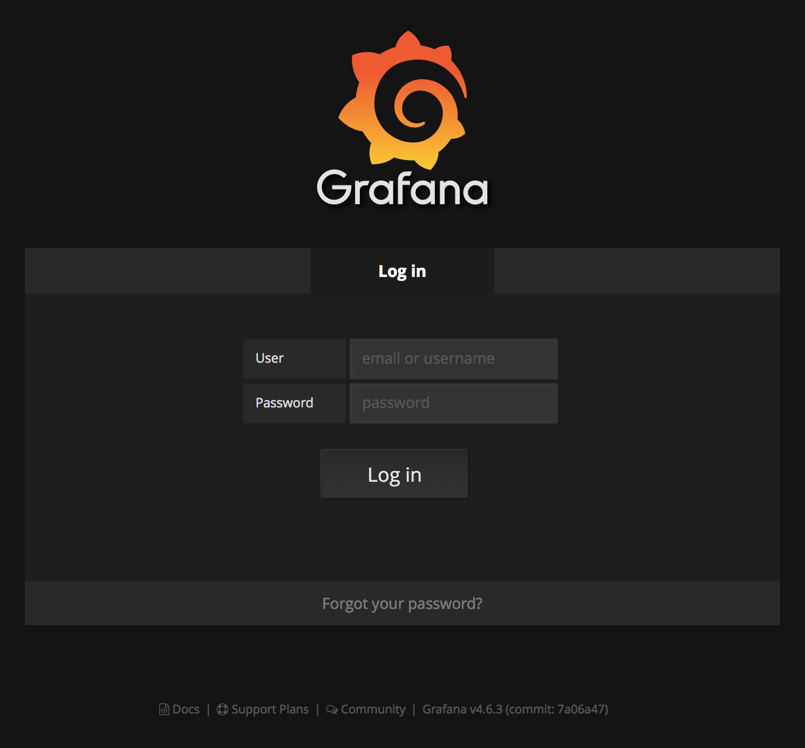
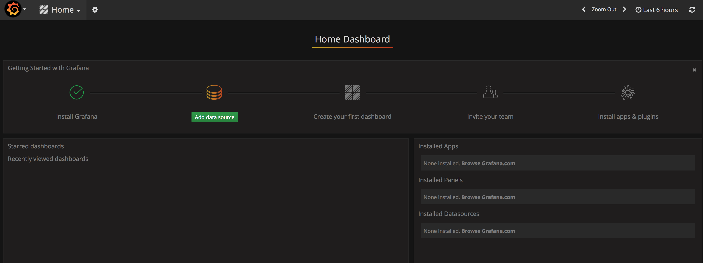
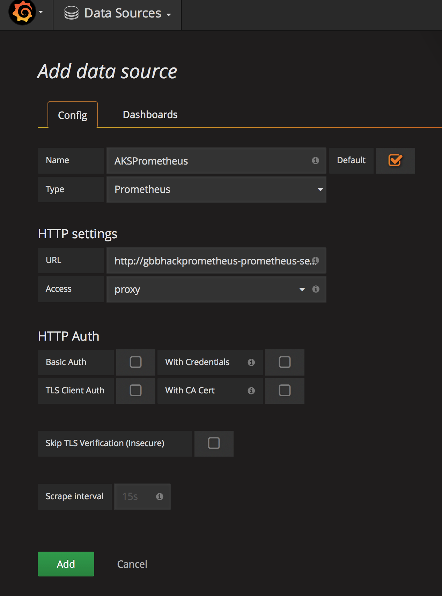
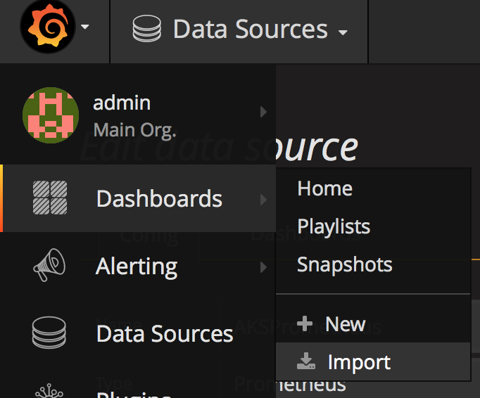
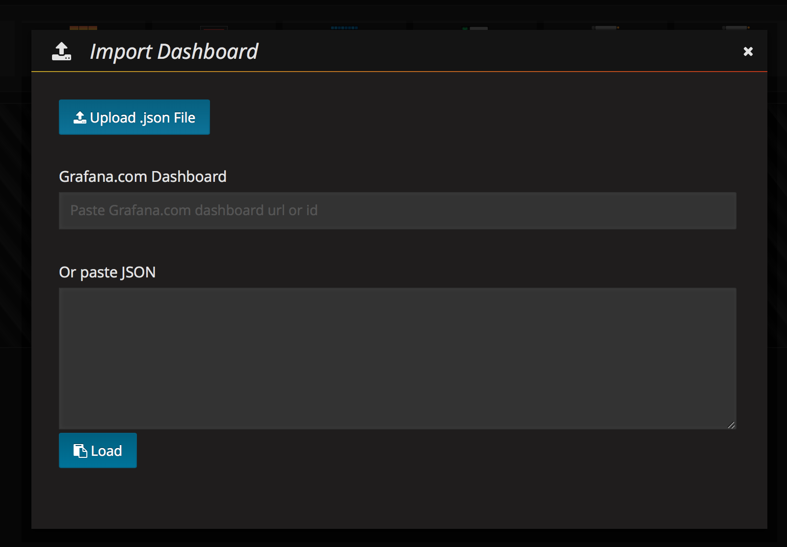
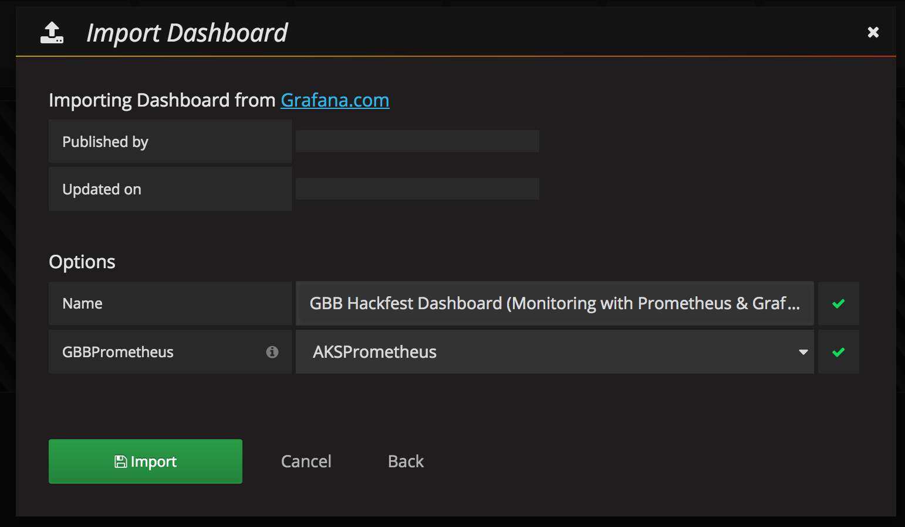
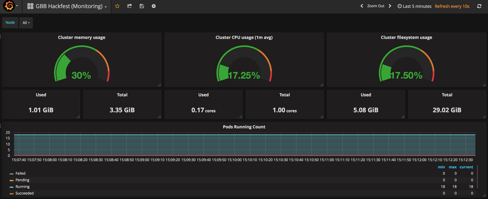

# Add Monitoring to an Azure Kubernetes Service Cluster

There are a number of monitoring solutions available today. Here is a quick, but not exhaustive list for reference purposes:
* Datadog
* Sysdig
* Elastic Stack
* Splunk
* Operations Management Suite
* Prometheus

For the purposes of this lab we will be focusing in on Prometheus and using Grafana to provide a visual Dashboard of our Azure Kubernetes Service Cluster.

## Exercise 1 - Install Helm

We are going to be installing Prometheus and Grafana into our K8s cluster using Helm and Tiller. You can think of Helm as a package manager for Kubernetes with Tiller being the server-side component.

1. Install Helm
* Click [here](https://docs.helm.sh/using_helm/#installing-helm) to install Helm CLI if it is not already installed.

2. Initialize Helm
```bash
helm init
```
3. Validate Helm and Tiller were installed successfully
```bash
helm version
# You should see something like the following as output:
Client: &version.Version{SemVer:"v2.7.2", GitCommit:"8478fb4fc723885b155c924d1c8c410b7a9444e6", GitTreeState:"clean"}
Server: &version.Version{SemVer:"v2.7.2", GitCommit:"8478fb4fc723885b155c924d1c8c410b7a9444e6", GitTreeState:"clean"}
```

## Exercise 2 - Install Prometheus using Helm
Prometheus is a Cloud Native Computing Foundation (CNCF) project used to collect and process metrics. It collects metrics from configured targets, in our case it is a Kubernetes Cluster.

1. Install Prometheus using Helm CLI
* Create a file in your local directory named **prometheus-configforhelm.yaml** leveraging the file located [here](prometheus-configforhelm.yaml).
```bash
# The following command will install Prometheus into the K8s cluster using custom settings.
helm install --name gbbhackprometheus stable/prometheus -f prometheus-configforhelm.yaml
```
2. Validate that Prometheus was Installed
``` bash
kubectl get pods | grep prometheus
# You should see something like the following as output:
gbbhackprometheus-prometheus-kube-state-metrics-5b9f4d9d9-vctrx   1/1       Running   0          3m
gbbhackprometheus-prometheus-node-exporter-v6frn                  1/1       Running   0          3m
gbbhackprometheus-prometheus-server-54f5bcb797-sbzsp              2/2       Running   0          3m
```

```bash
kubectl get svc | grep prometheus
# You should see something like the following as output:
gbbhackprometheus-prometheus-kube-state-metrics   ClusterIP      None           <none>          80/TCP           3m
gbbhackprometheus-prometheus-node-exporter        ClusterIP      None           <none>          9100/TCP         3m
gbbhackprometheus-prometheus-server               LoadBalancer   10.0.212.145   52.168.100.25   9090:32340/TCP   3m
```

## Exercise 3 - Install Grafana
Grafana is a dashboard visualization tool that can use all kinds of data sources. In our case, Prometheus will be used as the data source.

1. Install Grafana using Helm CLI
* The following command will install Grafana into the K8s cluster with a few custom settings to make it easier to access.

```bash
# We are setting the default username and password to **admin** to make it easier to remember.
# We are also setting the service type to **LoadBalancer** to expose the service outside of the cluster and make it accessible via the Internet.
helm install --name gbbhackgrafana stable/grafana --set server.service.type=LoadBalancer,server.adminUser=admin,server.adminPassword=admin
```
2. Validate that Grafana was Installed
```bash
kubectl get pods | grep grafana
# You should see something like the following as output:
hgrafana-grafana-855db78dc4-pnzth                           1/1       Running   0          2h
```

```bash
kubectl get svc | grep grafana
# You should see something like the following as output, take note of the **EXTERNAL-IP column**:
khgrafana-grafana                            LoadBalancer   10.0.163.226   "52.226.75.38"     80:31476/TCP   2h
```
3. Test Grafana UI Comes Up
Use the EXTERNAL-IP value from the previous step and put that into your browser:
* eg. http://52.226.75.38, EXTERNAL-IP column from above. You should see something like the following come up, be patient it will take a moment or two:



## Exercise 4 - Setting up Grafana
1. Log into Grafana Dashboard using *admin** for the username and password
* You should see something like the following:



2. Add Prometheus as a Data Source
* If you recall from above, we exposed a number of K8s services, one of those services was the Prometheus Server. We are going to use that Service endpoint in our Data Service configuration. The Add Data Source screen should look something like the following:



3. Validate Prometheus Data Source
* Once you have filled in the values similar to the screenshot above, click the **Add** button and ensure no errors come back.
4. Add K8s Monitoring Dashboard to Grafana
* After the datasource has been added, it is now time to add a dashboard. Grafana dashboards can be shared on Grafana dashboards. Goto import dashboards viam the menu in the top left.




* Use the file located [here](./helper_files/gbb_hackfest_grafana_dashboard.json) to import the json dashboard configuration by clicking the **Upload File** button.





* Note the linkage to the datasource created above.





* Click the **Import** button.





You should now have Prometheus and Grafana running in your Azure Kubernetes Service cluster and be able to see the Grafana Dashboard.
